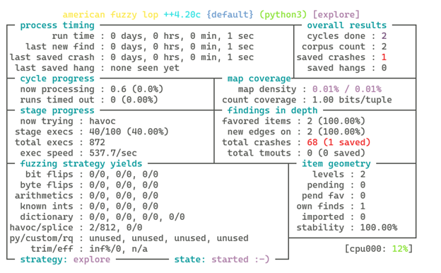
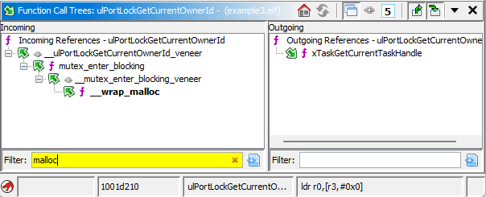
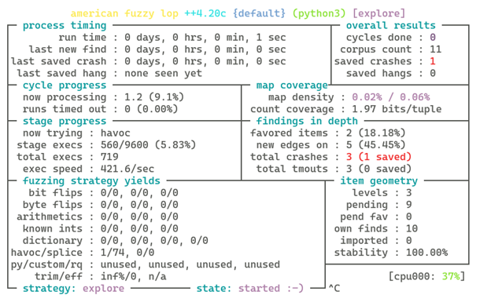

# Finding Heap Overflows with AFL++ Unicorn Mode

In my last post, I demonstrated a basic approach to fuzzing an RTOS firmware using AFL++'s Unicorn mode. The provided firmware for that exercise was relatively simple so that we could focus on the basics. In this post, I will introduce a slightly more complicated example and how to deal with the complications it introduces. Specifically, this firmware will complicate things by using dynamic memory and making access to OS and hardware features not under emulation. We will handle this by hooking various functions and replacing or short-circuiting their logic in Python. The demo firmware in [malloc_example.elf](./malloc_example.elf) configures the Pico W as a Wifi access point. After connecting, there is an HTTP endpoint for controlling the onboard LED exposed at [http://192.168.4.1/fuzzy.cgi](http://192.168.4.1/fuzzy.cgi) which accepts base64 encoded data through the query parameter `data`. As with the last example, this firmware contains symbols so we can focus on the mechanics of fuzzing rather than reversing. The target function is again `process_payload` which parses the input as a TLV-stream expressing commands for manipulating the on-board lights. 

Resources for this exercise have been posted to GitHub under [cy1337/afl_unicorn_heap](https://github.com/cy1337/afl_unicorn_heap).

## New Firmware
If you try to run the [script from last time](https://github.com/cy1337/basic_afl_unicorn/blob/main/pico_w_fuzz_example.py) with this [new ELF](./malloc_example.elf), you will get the following:
```
[INFO] Function 'process_payload' @ 0x100004ed
[INFO] Identified return 'bx lr' @ 0x10000ee0
[INFO] Starting AFL loop starting @ 0x100004ed with exit @ 0x10000ee0
Aborted
```
If you enable debugging (e.g. by setting `AFL_DEBUG=1`) you can see which instructions executed before the abort:
```
$ AFL_DEBUG=1 python3 ./pico_w_fuzz_example.py in/1
[INFO] Function 'process_payload' @ 0x100004ed
[INFO] Identified return 'bx lr' @ 0x10000ee0
[DEBUG] Mapped segment: addr=0x10000000 size=0x5d000 perms=5
[DEBUG] Mapped segment: addr=0x20000000 size=0x30000 perms=7
[DEBUG] Failed mapping at 0x20000000: Invalid memory mapping (UC_ERR_MAP)
[DEBUG] Mapped segment: addr=0x20040000 size=0x1000 perms=3
[INFO] Starting AFL loop starting @ 0x100004ed with exit @ 0x10000ee0
[u] [0.000034] Entering uc_afl_fuzz with input_file=in/1 and persistent_iters=1
[u] [0.000078] SHARED MEMORY FUZZING Feature is not enabled.
[u] [0.000136] fksrv_start returns 3
[DEBUG] Injecting input (2 bytes)
[DEBUG] Executing @ 0x100004ec (size=2)
[DEBUG] Executing @ 0x100004ee (size=2)
[DEBUG] Executing @ 0x100004f0 (size=2)
[DEBUG] Executing @ 0x100004f2 (size=2)
[DEBUG] Executing @ 0x100004f4 (size=2)
[DEBUG] Executing @ 0x100004f6 (size=2)
[DEBUG] Executing @ 0x100004f8 (size=2)
[DEBUG] Executing @ 0x100004fa (size=2)
[DEBUG] Executing @ 0x100004fc (size=2)
[DEBUG] Executing @ 0x100004fe (size=2)
[DEBUG] Executing @ 0x10000500 (size=2)
[DEBUG] Executing @ 0x10000502 (size=2)
[DEBUG] Executing @ 0x10000504 (size=2)
[DEBUG] Executing @ 0x10000506 (size=2)
[DEBUG] Executing @ 0x10000508 (size=2)
[DEBUG] Executing @ 0x1000050a (size=2)
[DEBUG] Executing @ 0x1000050c (size=2)
[DEBUG] Executing @ 0x10000586 (size=2)
[DEBUG] Executing @ 0x10000588 (size=2)
[DEBUG] Executing @ 0x1000058a (size=2)
[DEBUG] Executing @ 0x1000058c (size=2)
[DEBUG] Executing @ 0x1000058e (size=2)
[DEBUG] Executing @ 0x10000590 (size=2)
[DEBUG] Executing @ 0x10000592 (size=2)
Aborted
```
## Using Capstone Disassembly
In order to help troubleshoot this further, we will first update the script to print disassembled instructions. We can do this by creating an instance of Capstone configured to decode ARM Thumb mode instructions. We can then add debug logging to `hook_code` with disassembly. Initializing Capstone is as follows:
```python
from capstone import Cs, CS_ARCH_ARM, CS_MODE_THUMB
cs = Cs(CS_ARCH_ARM, CS_MODE_THUMB)
cs.detail = True
```
Then in the `hook_code` function, we use `uc.mem_read(address, size)` to read the instruction. It is disassembled with `cs.disasm` and printed:
```python
def hook_code(uc, address, size, user_data):
    debug("Executing @ 0x%08x (size=%d)", address, size)
    if logging.getLogger().getEffectiveLevel() == logging.DEBUG:
        instruction_bytes = uc.mem_read(address, size)
        for insn in cs.disasm(instruction_bytes, address):
            debug("\tInstruction: %s %s", insn.mnemonic, insn.op_str)
    return True
```

With these two changes in place, running the script again (with `AFL_DEBUG=1`) shows:
```
[DEBUG] Executing @ 0x10000592 (size=2)
[DEBUG]         Instruction: pop {r3, r4, r5, r6, r7, pc}
Aborted
```

## Cortex-M Function Returns
At this point, it should be clear that this was actually a return since `pc` is taking a value from the stack. In the simple example our function returned with a basic `bx lr` instruction. The more complicated fuzz target makes use of nested functions such that the register `lr` had to be pushed to the stack. The logic for finding a stop point to the fuzz is broken. In order to continue, we could hardcode the function exit at this address (`0x10000592`) but for the sake of learning, let's instead update the script to dynamically locate a good stop address for the fuzz. In order to do this, we can use Capstone to iterate over each instruction looking for `bx lr` or a `pop` to `pc`. This is done by reading in the text section of the program and feeding that through Capstone:

```python
def find_return_address(elf_path, func_addr):
    """
    Find the first return instruction (either 'bx lr' or 'pop {..., pc}') after func_addr in the .text section.
    Returns the virtual address of the instruction.
    """
    with open(elf_path, 'rb') as f:
        elffile = ELFFile(f)
        text_sec = elffile.get_section_by_name('.text')
        if not isinstance(text_sec, Section):
            raise RuntimeError(".text section not found in ELF")
        
        base = text_sec['sh_addr']
        data = text_sec.data()
        start_offset = func_addr - base - 1
        
        section_data = data[start_offset:]
        current_addr = func_addr & ~1  # Clear thumb bit if set
        
        try:
            for insn in cs.disasm(section_data, current_addr):
                if (insn.mnemonic == "bx" and insn.op_str == "lr") or (insn.mnemonic == "pop" and "pc" in insn.op_str.lower()):
                    debug("Found exit at 0x%x", insn.address)
                    return insn.address
                    
        except Exception as e:
            debug("Disassembly error: %s", str(e))
            
        raise RuntimeError(f"No return instruction found after 0x{func_addr:08x}")
```

With that change in place we can now fuzz through the function but we very quickly get a crash:


## Memory Dependencies
In order to evaluate the crash we can run the faulting testcase through a single execution with debugging enabled, we can see where it failed (e.g. run the script with `AFL_DEBUG=1` but natively rather than under `afl-fuzz`):
```
[DEBUG] Executing @ 0x1001d210 (size=2)
[DEBUG]         Instruction: ldr r0, [r3]
Aborted
```

If you analyze (e.g. in Ghidra) around that instruction you would find that this is within the call tree for `__wrap_malloc` (and `__wrap_free`):



A review of the decompiled function reveals that this failure happens because the malloc implementation attempts to dereference a pointer from the FreeRTOS task structure that we haven't initialized in the emulator. This is why, when available, I like to load a memory dump from the real device into my emulator when initializing the fuzz. Examples of how to do this are in the AFL++ [unicorn_mode/helper_scripts](https://github.com/AFLplusplus/AFLplusplus/tree/stable/unicorn_mode/helper_scripts) but for this example, we are going to instead replace the malloc implementation with some Python code that will also allow us to catch subtle memory safety issues.

## A New Heap
To make this work, we map a new memory region for heap, `0x30000000 - 0x300100000`, create a Python class `HeapManager` to track allocations within the space. It is important to reserve space between heap allocations so that there are ranges of unused addresses (e.g. guard pages) we can monitor to recognize memory safety issues. This is plumbed in by using the `uc.hook_add` method to register a python function to run when a specific instruction address executes.
```python
    uc.hook_add(UC_HOOK_CODE, hook_malloc_wrapper, begin=malloc_addr, end=malloc_addr+2)
```

The hook function itself then looks like:
```python
    def hook_malloc_wrapper(uc, address, size, user_data):
        malloc_hook(uc, heap)
        # Skip the actual function
        uc.reg_write(UC_ARM_REG_PC, uc.reg_read(UC_ARM_REG_LR))
```

The actual allocation happens then in `malloc_hook`:
```python
def malloc_hook(uc, heap):
    size = uc.reg_read(UC_ARM_REG_R0)
    addr = heap.malloc(size)
    uc.reg_write(UC_ARM_REG_R0, addr)
    debug("malloc(%d) = 0x%x", size, addr)
```

You can see there that the argument for `malloc` is read from register `r0` per the convention for this architecture. A similar hook is implemented for freeing allocations and we also add hooks to examine memory access so we can catch OOB access:
```python
    uc.hook_add(UC_HOOK_MEM_READ, hook_mem_access, user_data=heap)
    uc.hook_add(UC_HOOK_MEM_WRITE, hook_mem_access, user_data=heap)
```

On each read or write, we are checking if the address is within the heap range and, if so, using `HeapManager.check_access` to match the address up against current allocations. The hook sends a `SEGV` signal to trigger a crash if anything tries to access an address within one of the guard pages.

The implementation for that is as follows:
```python
def hook_mem_access(uc, access, address, size, value, user_data):
    heap = user_data
    if HEAP_ADDR <= address < HEAP_ADDR + HEAP_SIZE:
        if not heap.check_access(address, size, access == UC_HOOK_MEM_WRITE):
            # Invalid access, signal crash to AFL
            debug("Unsafe memory access detected at 0x%x, crashing...", address)
            os.kill(os.getpid(), signal.SIGSEGV)
            return True
    return True
```

AFL++ also provides an example heap implementation in the repo under [unicorn_mode/helper_scripts/unicorn_loader.py](https://github.com/AFLplusplus/AFLplusplus/blob/c47221db7cc9b56e3c325d3a9c61863e7369e158/unicorn_mode/helper_scripts/unicorn_loader.py#L54).

## Adding More Hooks
With this heap checking logic in place, the next thing we find when returning to fuzz is that `memcpy` is also dependent on some memory we didn't initialize. Presumably this pointer would have been configured at runtime so our options are to either consult with a live system (e.g. via `gdb`) or we can once again implement the logic we need within Python. To implement `memcpy` we pull the arguments from registers `r0`-`r2` and then use the size from `r2` to read from the address in `r1` and write that data to the address in `r0`:

```python
def memcpy_hook(uc, heap):
    dst = uc.reg_read(UC_ARM_REG_R0)
    src = uc.reg_read(UC_ARM_REG_R1)
    size = uc.reg_read(UC_ARM_REG_R2)
    
    debug("memcpy(dst=0x%x, src=0x%x, size=%d, size_type=%s)", dst, src, size, type(size))
    
    try:
        # The memory hooks will validate the access
        data = uc.mem_read(src, int(size))
        uc.mem_write(dst, bytes(data))
    except Exception as e:
        debug("memcpy: Memory access error: %s", str(e))
        debug("size type: %s, value: %r", type(size), size)
        os.kill(os.getpid(), signal.SIGSEGV)
        return
    
    # Set return value to destination address (per memcpy spec)
    uc.reg_write(UC_ARM_REG_R0, dst)
```

Continue with the fuzz from here and you'll find some other functions that we can't or even don't want to emulate and will need to patch out. We do this by adding hooks to log that the function was called and then jump back to `lr` to resume the calling function. In the completed example on GitHub, you'll see that I've done this for `cyw43_gpio_set` which is backed by hardware and `sleep_ms` which relies on support from the kernel that is not running in our fuzz. (Sleeping is also is generally undesirable for fuzzing anyway of course.)

## Fuzzing Results
With all these pieces in place, the fuzzer should report crashes quite quickly:


You can test this for yourself with the completed sample script [pico_w_malloc_fuzz_example.py](./pico_w_malloc_fuzz_example.py).

If you run the crashing testcase through the script with `AFL_DEBUG=1`, you can see that it has triggered our heap memory protection:
```
[DEBUG] Invalid read access at 0x30000008
[DEBUG] Unsafe memory access detected at 0x30000008, crashing...
Segmentation fault
```

## Upcoming Class
This repo contains an introduction to using AFL++ Unicorn mode. For a deep dive into this and a handful of other bug hunting techniques, please consider joining me at Black Hat USA 2025 for A Bug Hunters Guide to Binaries and Firmware. In general, this class equips students for bug hunting using freely available tools. On the first day, we will author a few Ghidra scripts ([example 1](https://medium.com/@cy1337/vulnerability-analysis-with-ghidra-scripting-ccf416cfa56d), [example 2](https://medium.com/@cy1337/tracing-data-flow-with-pcode-f879278d9fc1)) for directly finding vulnerabilities as well as a few scripts which leverage our reversing efforts by automating integration with external tools like Frida or GDB ([example](https://medium.com/@cy1337/a-basic-guide-to-discovering-attack-surface-with-ghidra-and-gdb-370e2c08e4c1)). Similar to last year, on the second day we will focus on AFL++ fuzzing of compiled Linux programs ([example](https://medium.com/@cy1337/a-basic-guide-to-afl-qemu-495df504b5fb)) as well as embedded systems. This class leverages my years of experience teaching students at Black Hat and other events on how to get the most out of Ghidra as well as my years of experience finding and reporting vulnerabilities.

If you or your team would like to get the most out of your time at Black Hat USA, please consider signing up for [A Bug Hunters Guide to Binaries and Firmware](https://www.blackhat.com/us-25/training/schedule/#a-bug-hunters-guide-to-binaries-and-firmware-444411736890494).
